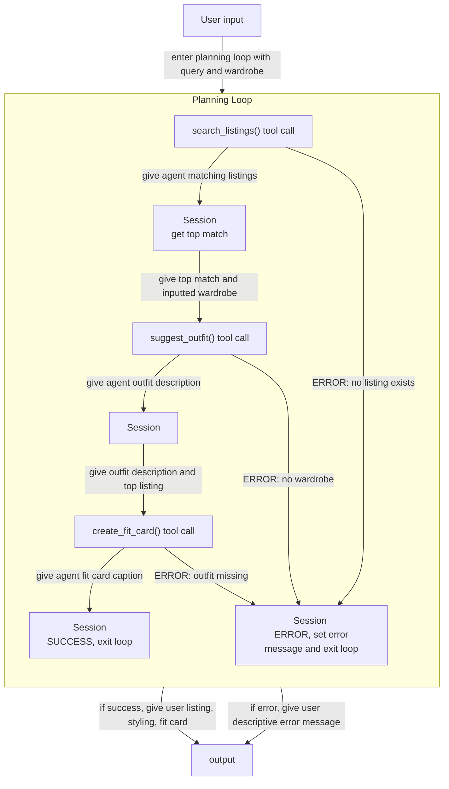

# FitFindr — planning.md

> Complete this document before writing any implementation code.
> Your spec and agent diagram are what you'll use to direct AI tools (Claude, Copilot, etc.) to generate your implementation — the more specific they are, the more useful the generated code will be.
> Your planning.md will be reviewed as part of your submission.
> Update it before starting any stretch features.

---

## Tools

List every tool your agent will use. For each tool, fill in all four fields.
You must have at least 3 tools. The three required tools are listed — add any additional tools below them.

### Tool 1: search_listings

**What it does:**
This tool searches the listings for items matching the user's query request. 

**Input parameters:**
- `description` (str): a description of the item. Required Field.
- `size` (str): the size of the item requested. If not provided, will use any size that matches other criteria best.
- `max_price` (float): the max price of the item requested. If not provided, will use any price that matches other criteria best. 

**What it returns:**
The return value is a list of listings that match the user query, `matches` (list[dict]).

**What happens if it fails or returns nothing:**
If there are no listings that match, the agent will terminate the conversation and inform the user to try something else.

---

### Tool 2: suggest_outfit

**What it does:**
This tool takes the top item found from search results and the user's wardrobe (i.e. style) and returns how to style the item with their current items. 

**Input parameters:**
- `new_item` (dict): This is the top (first) listing from the `matches` returned by search_listings in step 1.
- `wardrobe` (dict): This represents the user's current clothing and their preferences. 

**What it returns:**
This should return a string describing the outfit that would work best with the item from what is currently available in the wardrobe.

**What happens if it fails or returns nothing:**
If no outfit can be suggested, the tool returns general styling advice for the item.

---

### Tool 3: create_fit_card

**What it does:**
This tool takes the outfit description and the top item being thrifted to create a short caption that can be used on Instagram/TikTok.

**Input parameters:**
- `outfit` (str): a string describing the outfit that would work best with the item listed
- `new_item` (dict): This is the top (first) listing from the `matches` returned by search_listings in step 1 (same item as Tool 2).

**What it returns:**
This tool returns a short string which can be used as a social media caption for the outfit.

**What happens if it fails or returns nothing:**
If the outfit is incomplete, the tool should return an error message describing what is missing. It should not error suddenly or silently.

---

### Additional Tools (if any)

<!-- Copy the block above for any tools beyond the required three -->

---

## Planning Loop

**How does your agent decide which tool to call next?**
The agent follows a strict sequential pipeline:
1. **Call search_listings()** with the user's query parameters (description, optional size, optional max_price)
2. **Check results**: If search_listings returns an empty list, terminate and tell the user no matches were found
3. **Extract top result**: If results exist, take the first item (index 0) from the matches list
4. **Call suggest_outfit()** with the top result and the user's wardrobe to get styling advice
5. **Call create_fit_card()** with the outfit description and top result to generate a social media caption
6. **Return final response** with the listing, outfit suggestion, and caption to the user

The agent does not loop or retry — it follows this path once per user query.

---

## State Management

**How does information from one tool get passed to the next?**
The agent maintains the following state throughout a single user session:
- **search_results** (list[dict]): The full list of listings returned from search_listings()
- **top_result** (dict): The first item from search_results, selected for styling (extracted before calling suggest_outfit)
- **wardrobe** (dict): The user's wardrobe preferences, extracted from the user's input message
- **outfit_description** (str): The styling suggestion returned from suggest_outfit() for the top_result
- **final_caption** (str): The social media caption returned from create_fit_card()

Each tool's output becomes direct input to the next tool:
- search_listings output → extract top_result → input to suggest_outfit
- suggest_outfit output (outfit_description) → input to create_fit_card along with top_result
- create_fit_card output → final_caption returned to user

State persists only within a single user query — each new query starts fresh.

---

## Error Handling

For each tool, describe the specific failure mode you're handling and what the agent does in response.

| Tool | Failure mode | Agent response |
|------|-------------|----------------|
| search_listings | No results match the query | Tells the user: "No listings match your request, try loosening your requirements or searching for something else." |
| suggest_outfit | Wardrobe is empty | Tells the user: "It seems your wardrobe is empty, so here is some general styling advice for your item: ..." |
| create_fit_card | Outfit input is missing or incomplete | Tells user: "A post caption for this outfit cannot be generated." |

---

## Architecture

<!-- Draw a diagram of your agent showing how the components connect:
     User input → Planning Loop → Tools (search_listings, suggest_outfit, create_fit_card)
                                                                          ↕
                                                                   State / Session
     Show what triggers each tool, how state flows between them, and where error paths branch off.
     ASCII art, a Mermaid diagram (https://mermaid.js.org/syntax/flowchart.html), or an embedded
     sketch are all fine. You'll share this diagram with an AI tool when asking it to implement
     the planning loop and each individual tool. -->

---

## AI Tool Plan

<!-- For each part of the implementation below, describe:
     - Which AI tool you plan to use (Claude, Copilot, ChatGPT, etc.)
     - What you'll give it as input (which sections of this planning.md, your agent diagram)
     - What you expect it to produce
     - How you'll verify the output matches your spec before moving on

     "I'll use AI to help me code" is not a plan.
     "I'll give Claude my Tool 1 spec (inputs, return value, failure mode) and ask it to implement
     search_listings() using load_listings() from the data loader — then test it against 3 queries
     before trusting it" is a plan. -->

**Milestone 3 — Individual tool implementations:**
I'll give Claude my tool specs and ask it to implement each tool. Before moving onto the next tool, I'll test the current tool with some queries.

**Milestone 4 — Planning loop and state management:**
I'll give Claude the architecture diagram and ask it to implement the control flow specified. I'll check the approprite error and success states before moving on to check the whole control flow.

---

## A Complete Interaction (Step by Step)

Write out what a full user interaction looks like from start to finish — tool call by tool call. Use a specific example query.

**Example user query:** "I'm looking for a vintage graphic tee under $30. I mostly wear baggy jeans and chunky sneakers. What's out there and how would I style it?"

**Step 1:**
The agent first uses the search_listings() tool to search for a vintage graphic tee under $30 (inputs are description, size, max_price). If the tool finds any results, it returns the listings back to the agent as a dict. 
E.G. search_listing("vintage graphic tee", max_price=30) returns [{listing1}, {listing2}]

**Step 2:**
After receiving the dict with the listings, the agent calls suggest_outfit() tool to take each matching listing and style it with the inputted wardrobe (inputs are ONE listing and a wardrobe). The tool returns a description of the outfit to the agent.
E.G. suggest_outfit(listing1, wardrobe) returns "style this tee with your light jeans for a fun look."

**Step 3:**
The agent receives the outfit and calls the create_fit_card() tool (inputs are the outfit string and the listed item). The tool generates a short caption for the outfit and clothing item to post on Instagram/TikTok. 
E.G. create_fit_card(outfit, listing1) returns "thrifted this tee from Depop and it goes so well with my jeans! Love it!!"

**Final output to user:**
The user can see one of two things:
1. Listing match -- There exists a listing that matches what the user wanted. They see the top match, how to style it, and a fit card to share. 
E.G. "Great! I found a match for you: {listing1}. You can style it like this: {outfit_description}. Here's a caption you can use: {fit_card_caption}"

2. No Match -- There is no listing that matches the user's request. They see that there is no clothing that matches and are asked to try again with a different clothing item.
E.G. "Unfortunately, there are no matches for your request. Try loosening your search or asking for a different item."